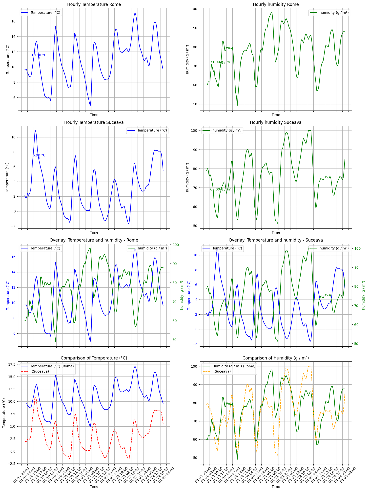

# Weather Analysis Data

## Overview

This project provides an analysis of weather data, with a focus on differences between temperature and humidity in two different cities. The dataset contains various weather-related metrics, such as temperature, humidity, wind speed, and more, collected over time. The project aims to perform statistical analysis and visualizations to uncover meaningful insights about weather patterns.

## Getting Started

To run this project locally, follow the steps below:

### Prerequisites

Ensure you have the following installed on your machine:

- Python 3.x
- Required Python libraries:
  - pandas
  - numpy
  - matplotlib
  - requests
  - datetime

### Installation

1. Clone the repository:
   ```bash
   git clone https://github.com/DanielIVirlan/Weather-analysisis-data.git
   

2. cd Weather-analysisis-data


3. pip install -r requirements.txt


4. Run the Jupyter Notebook or Python scripts to start the analysis.


## Graph




